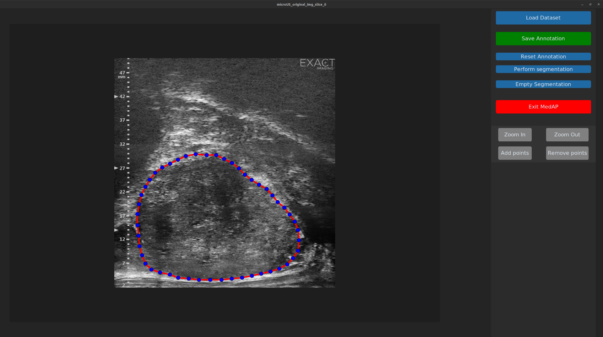

# MedAP Contour Editor

MedAP Contour Editor is annotation platform for medical image segmentation.
The platform utilizes deep learning segmentation models for pre-annotation process that reduces the annotator efforts.
MedAP performs pre-annotation and stored the original image, segmentation mask and annotated image with created outer contour.



Main MedAP components:

- GUI - [Tkinter](https://docs.python.org/3/library/tkinter.html) 
- Deep Learning model - [MUCSNet](https://www.kaggle.com/models/lukaiktar/mucsnet_prostate) (modified MicroSegNet model for segmentation of whole prostate sweep)


---

## Requirements

- Docker installed ([Install Docker](https://docs.docker.com/get-docker/))
- NVIDIA GPU with drivers installed
- NVIDIA Container Toolkit ([Install Guide](https://docs.nvidia.com/datacenter/cloud-native/container-toolkit/install-guide.html))
- X11 (on Linux) to forward GUI from container
- Download 'networks' folder from [link](https://github.com/lukasiktar/TransUNet_custom)
- Download model from [link](https://www.kaggle.com/models/lukaiktar/mucsnet_prostate) and name the file 'MUCSNet.pth'

---

## Build Docker Image

```bash
docker build -t docker-image:tag .

xhost +local:docker

docker run -it \
  -e DISPLAY=$DISPLAY \
  -v /tmp/.X11-unix:/tmp/.X11-unix \
  --gpus all \
  docker-image:tag
```
